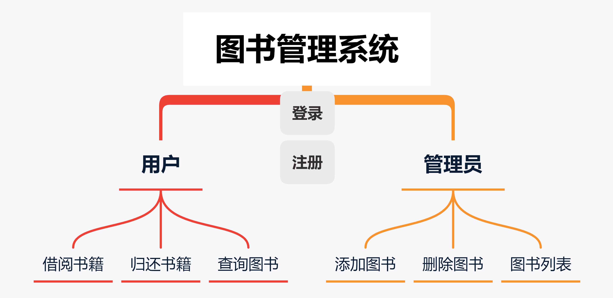

 

> | 姓名：汤尧             | 学号：3200106252     |
> | ---------------------- | -------------------- |
> | 课程名称：数据库系统   | 任课老师：陈璐       |
> | 实验名称：图书管理系统 | 实验日期：2022-04-14 |

## 1  实验目的和要求

1、 设计并实现一个精简的图书管理系统，具有入库、查询、借书、还书、借书证管理 等基本功能。 

2、 通过本次设计来加深对数据库的了解和使用，同时提高自身的系统编程能力。

## 2  实验平台

- 程序语言：python
- 数据库：MySQL 8.0
- 编译环境：Python3
- 图形化库：tkinter

## 3  总体设计

#### 功能设计

本系统主要包括管理员登录、图书入库、图书查询、借书管理、还书管理、借书证管理 六大功能模块。功能如下图：

建立三个table，之间的逻辑关系如图：

画出E-R图，则有以下关系：

设计好关系型数据库的schema后，我们可以列出所有

