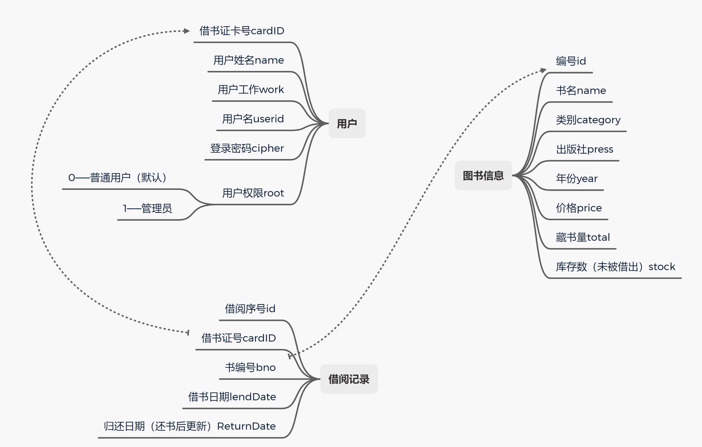

 

> | 姓名：汤尧             | 学号：3200106252     |
> | ---------------------- | -------------------- |
> | 课程名称：数据库系统   | 任课老师：陈璐       |
> | 实验名称：图书管理系统 | 实验日期：2022-04-14 |

## 1  实验目的和要求

1、 设计并实现一个精简的图书管理系统，具有入库、查询、借书、还书、借书证管理 等基本功能。 

2、 通过本次设计来加深对数据库的了解和使用，同时提高自身的系统编程能力。

## 2  实验平台

- 程序语言：python
- 数据库：MySQL 8.0
- 编译环境：Python3
- 图形化库：tkinter

## 3  总体设计

#### 功能设计

本系统主要包括管理员登录、图书入库、图书查询、借书管理、还书管理、个人信息、借书证管理七大功能模块。项目运行逻辑架构如下图：


###### 分析功能需求

- 欢迎页面
	- 登录
		- 在此页面输入用户名和密码，密码开启保护模式。
		- 如果输入正确的用户名和密码，则可以进入账号对应权限的页面。如果登录错误则会提示”用户名或密码错误“。

	- 注册
		- 用户注册后自动进入用户界面，因为所有用户只要注册都可以拥有读者权限，因此不需要注册后再通过登录进入功能界面。

- 用户界面
  - 借阅书籍
  	- 用户可以浏览所有图书馆里的书籍并且选择是否借阅，对于一本书籍只能借阅一次，如果本书籍没有库存则无法借阅。
  - 归还图书
  	- 用户可以查看自己借阅未还的所有书籍，并且选择归还，系统将自动记录还书日期。
  - 查询图书
  	- 用户可以通过书籍类别，书籍名称，书籍作者，书籍出版社等信息粗略搜索图书。
  - 个人信息
  	- ：用户可以看到自己的基础信息（姓名，工作）、所有借阅信息（已归还，待归还），并且可以修改登录密码。
- 管理员界面
  - 添加图书
  	- 管理员需要同时添加图书的所有信息才可以添加图书。
  - 图书列表
    - 管理员可以查看所有图书信息，并且可以删除图书。
    - 如果想要修改书籍，那么建议删除之后重新添加书籍信息。
  - 用户列表
    - 管理员可以设置用户为管理员，给用户提升权限。
    - 管理员可以删除用户信息。
  - 借阅记录
    - 管理员可以查看所有借书记录，借阅人以及还书信息。

整理出本项目的实体数据，之间的逻辑关系如图：



#### 数据库设计

画出E-R图，则有以下关系：


设计好关系型数据库的schema后，我们可以列出所有数据类型。

###### 图书表

| Table                | book         |
| -------------------- | ------------ |
| **bno**(primary key) | int PK       |
| category             | char(10)     |
| title                | varchar(40)  |
| press                | varchar(30)  |
| year                 | int          |
| author               | varchar(20)  |
| price                | decimal(7,2) |
| total                | int          |
| stock                | int          |

###### 用户借书卡表

| Table:                  | card        |
| ----------------------- | ----------- |
| **cardID**(primary key) | int AI PK   |
| username                | varchar(10) |
| userwork                | varchar(20) |
| userid                  | varchar(20) |
| secret                  | varchar(32) |
| root                    | int         |

###### 借阅记录表

| **Table:**              | lendrecord |
| ----------------------- | ---------- |
| **id**(primary key)     | int AI PK  |
| **cardID**(foreign key) | int        |
| **bno**(foreign key)    | int        |
| lendDate                | date       |
| backDate                | date       |

## 4  实验过程

#### 数据库建立

规范数据类型后，用SQL的语句创建表格。（以图书信息为例）

```sql
create table book (bno int ,
category char(10),
title varchar(40),
press varchar(30),
year int,
author varchar(20),
price decimal(7,2),
total int ,
stock int
primary key (bno)) ;
```

在建立好数据库后，通过insert添加数据，可以发现在MySQL Workbench中看到数据添加成功。


### python和MySQL进行交互

根据连接规范，引入`pymysql`之后，进行连接。

```python
import pymysql
class DB:
    def __init__(self):
        self.con=pymysql.connect(
            host='127.0.0.1',
            port=3306,
            user='root',
            password='11223344',
            database='lab5',
            charset='utf8',
            cursorclass=pymysql.cursors.DictCursor)
        self.cur = self.con.cursor()

    def query_sql(self,sql):
        self.cur.execute(sql)
        return self.cur.fetchall()

    def update_sql(self,sql):
        self.cur.execute(sql)
        self.con.commit()

    def close(self):
        self.cur.close()
        self.con.close()
```

本次实验中我将所有和数据库交互的文件全部写在了sql.py文件中，主要为以下函数：

- 类`Identity`

  | 方法                         | 功能                                                         |
  | ---------------------------- | ------------------------------------------------------------ |
  | login(self, userid, cipher): | 传入用户名和密码，返回此用户权限；若用户名和密码不对则返回空列表。 |
  |                              |                                                              |
  |                              |                                                              |
  |                              |                                                              |
  |                              |                                                              |
  |                              |                                                              |
  |                              |                                                              |
  |                              |                                                              |
  |                              |                                                              |

  

  - def login(self, userid, cipher):传入用户名和用户
  - 

- 类`Books`
	- 
	- 


### 遇到问题及解决方案

1. 当数据库传入数据为空时，python会接收到一个空的list，要判断它是否为空，可以通过判断是否为空列表`()`。

	```python
	value = Identity().login(name,encrypt)
		if value==():
		showinfo(title='错误', message='账号或密码错误！') 
	```

2. 发现调用函数参数看起来是对的但是报错了

​                               

调用Identity类中的方法Identity.changepwd(1,encrypt)

改成：Identity().changepwd(1,encrypt)，即可

2. 报错信息如下

 

是因为传参的时候，没有传递正确格式，将格式改为：

 

拿到值的时候发现没有返回值，后来发现因为没打括号。

##  5  实验结果

#### 登录界面

#### 注册界面

#### 个人页面

###### 借阅图书

###### 归还图书

###### 借阅记录

###### 个人信息

#### 管理员界面

###### 所有图书

###### 所有读者

###### 借阅记录

## 6  实验心得

本次实验我尝试使用python语言，算是第一次用python语言写一个项目。很大的问题在于python的各种数据结构和函数调用方法的不熟悉，由于其数据为弱类型所以和c语言差异很大，经常出现因为写错了而