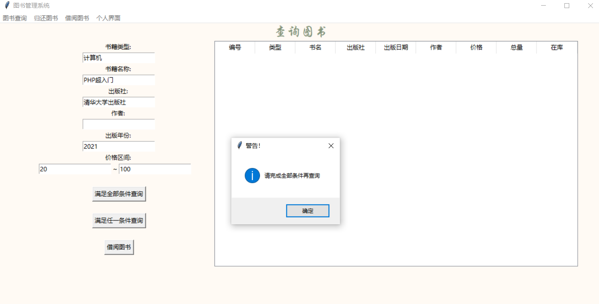
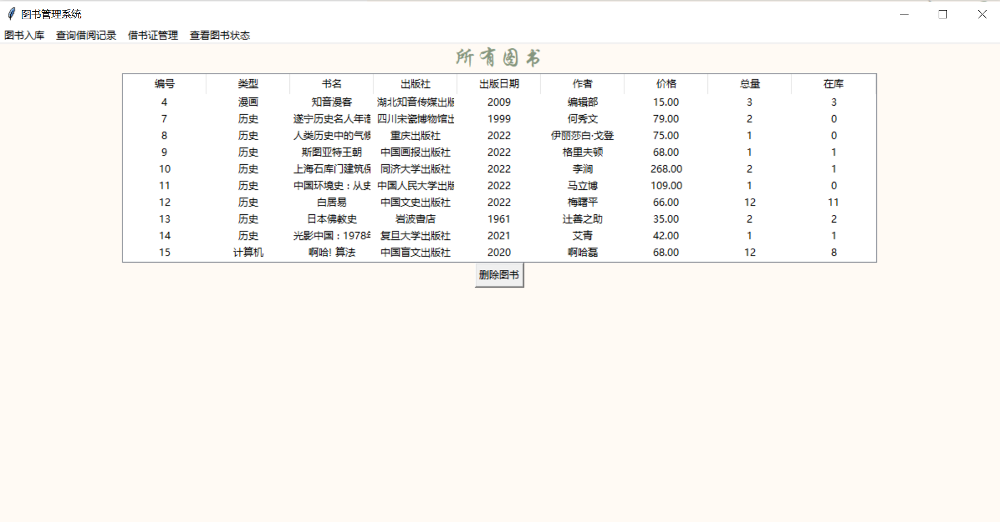

 

> | 姓名：汤尧             | 学号：3200106252     |
> | ---------------------- | -------------------- |
> | 课程名称：数据库系统   | 任课老师：陈璐       |
> | 实验名称：图书管理系统 | 实验日期：2022-04-14 |

## 1  实验目的和要求

1、 设计并实现一个精简的图书管理系统，具有入库、查询、借书、还书、借书证管理 等基本功能。 

2、 通过本次设计来加深对数据库的了解和使用，同时提高自身的系统编程能力。

## 2  实验平台

- 程序语言：python
- 数据库：MySQL 8.0
- 编译环境：Python3
- 图形化库：tkinter

## 3  总体设计

#### 功能设计

本系统主要包括管理员登录、图书入库、图书查询、借书管理、还书管理、个人信息、借书证管理七大功能模块。项目运行逻辑架构如下图：


###### 分析功能需求

- 欢迎页面
	- 登录
		- 在此页面输入用户名和密码，密码开启保护模式。
		- 如果输入正确的用户名和密码，则可以进入账号对应权限的页面。如果登录错误则会提示”用户名或密码错误“。

	- 注册
		- 用户注册后自动进入用户界面，因为所有用户只要注册都可以拥有读者权限，因此不需要注册后再通过登录进入功能界面。
- 用户界面
  - 借阅书籍
  	- 用户可以浏览所有图书馆里的书籍并且选择是否借阅，对于一本书籍只能借阅一次，如果本书籍没有库存则无法借阅。
  - 归还图书
  	- 用户可以查看自己借阅未还的所有书籍，并且选择归还，系统将自动记录还书日期，并且在书籍的库存量中增加。
  - 查询图书
  	- 用户可以通过书籍类别，书籍名称，书籍作者，书籍出版社，书籍出版时间等信息粗略搜索图书，也可选择精确查询，查找满足所有条件的图书。
  - 个人信息
  	- 用户可以看到自己的基础信息（姓名，工作）、所有借阅信息（已归还，待归还），并且可以修改登录密码。
- 管理员界面
  - 添加图书
  	- 管理员需要同时添加图书的所有信息才可以添加图书。
  - 图书列表
    - 管理员可以查看所有图书信息，并且可以删除图书。
    - 只有此图书所有册被归还才能删除图书。
    - 如果想要修改书籍，那么建议删除之后重新添加书籍信息。
  - 用户列表
    - 管理员可以设置用户为管理员，给用户提升权限。
    - 管理员可以删除用户信息。
    - 只有当用户归还所有书籍，管理员才可以删除用户借书证。
  - 借阅记录
    - 管理员可以查看所有借书记录，借阅人以及还书信息。
    - 只有当图书已经被归还才能删除借阅记录。

整理出本项目的实体数据，之间的逻辑关系如图：


#### 数据库设计

画出E-R图，则有以下关系：


设计好关系型数据库的schema后，我们可以列出所有数据类型。

###### 图书表

| Table                | book         |
| -------------------- | ------------ |
| **bno**(primary key) | int PK       |
| category             | char(10)     |
| title                | varchar(40)  |
| press                | varchar(30)  |
| year                 | int          |
| author               | varchar(20)  |
| price                | decimal(7,2) |
| total                | int          |
| stock                | int          |

###### 用户借书卡表

| Table:                  | card        |
| ----------------------- | ----------- |
| **cardID**(primary key) | int AI PK   |
| username                | varchar(10) |
| userwork                | varchar(20) |
| userid                  | varchar(20) |
| secret                  | varchar(32) |
| root                    | int         |

###### 借阅记录表

| **Table:**              | lendrecord |
| ----------------------- | ---------- |
| **id**(primary key)     | int AI PK  |
| **cardID**(foreign key) | int        |
| **bno**(foreign key)    | int        |
| lendDate                | date       |
| backDate                | date       |

## 4  实验过程

#### 数据库建立

规范数据类型后，用SQL的语句创建表格。（以图书信息为例）

```sql
create table book (bno int ,
category char(10),
title varchar(40),
press varchar(30),
year int,
author varchar(20),
price decimal(7,2),
total int ,
stock int
primary key (bno)) ;
```

在建立好数据库后，通过insert添加数据，可以发现在MySQL Workbench中看到数据添加成功。


#### python和MySQL进行交互

根据连接规范，引入`pymysql`之后，进行连接。这里我们连接到本地数据库，也就是`127.0.0.1`，端口号为3306。在连接之前需要在数据库建立好lab5的database，默认使用root账号登录，使用`utf8`进行解码，并且将当前操作指针指向cursor。

```python
import pymysql
class DB:
    def __init__(self):
        self.con=pymysql.connect(
            host='127.0.0.1',
            port=3306,
            user='root',
            password='*',  #这里是个人数据库密码，实验报告中隐去
            database='lab5',
            charset='utf8',
            cursorclass=pymysql.cursors.DictCursor)
        self.cur = self.con.cursor()
```

接下来是几个向数据库发送请求的函数。`query_sql`主要用于向数据库发出查找请求，会返回查询到的信息。`update_sql`主要用于向数据库发出所有非查找的请求，例如插入，删除，修改，不需要返回值。

```python
def query_sql(self,sql):
    self.cur.execute(sql)
    return self.cur.fetchall()

def update_sql(self,sql):
    self.cur.execute(sql)
    self.con.commit()

def close(self):
    self.cur.close()
    self.con.close()
```

本次实验中我将所有和数据库交互的功能函数全部写在了sql.py文件中，主要为两类`Identity`和`Books`。分别包括以下类的成员函数：

- 类`Identity`

  | 函数                                   | 功能                                                         |
  | -------------------------------------- | ------------------------------------------------------------ |
  | login(self, userid, cipher):           | 传入用户名和密码，返回此用户权限；若用户名和密码不对则返回空列表。 |
  | checkID(self, name)                    | 传入用户名，返回用户借书证的卡号，用于将用户名转化成主键。   |
  | changepwd(self, userid, cipher)        | 更改用户密码，传入用户名和新密码（默认在登录状态进行）       |
  | register(self, name, work, id, cipher) | 注册新用户，传入基本信息                                     |
  | allIdentity(self)                      | 获取所有用户信息，返回值为list类型，其中每一个tuple保存了一个用户的各类信息 |
  | userIdentity(self,id)                  | 获取借书卡号为id的用户信息                                   |
  | deleteCard(self, cardid)               | 删除用户，当用户还有借阅信息的时候不允许删除账号             |
  | setroot(self, cardid)                  | 将卡号为cardid的用户设置为管理员权限                         |

- 类`Books`

  | 函数                                                         | 功能                                                         |
  | ------------------------------------------------------------ | ------------------------------------------------------------ |
  | insertBook(self, bno, category, title, press, year, author, price, total, stock) | 输入图书全部基本信息，插入新图书信息                         |
  | allBook(self)                                                | 查询所有图书信息                                             |
  | queryBookbyName(self,name)                                   | 查询书籍名称为name的所有图书信息                             |
  | queryBookbyAuthor(self,name)                                 | 查询书籍作者为name的所有图书信息                             |
  | queryBookbyYear(self,name)                                   | 查询书籍出版日期为name的所有图书信息                         |
  | queryBookbyCategory(self,name)                               | 查询书籍类别为name的所有图书信息                             |
  | queryBookbyPress(self,name)                                  | 查询书籍出版社为name的所有图书信息                           |
  | queryBookbyPrice(self, minprice, maxprice)                   | 查询价格在minprice和maxprice之间的图书信息，若未输入则默认不限制 |
  | queryBookbyAll(self,title, press, author, category, minprice, maxprice): | 查询满足所有输入条件的图书信息                               |
  | lendBook(self,cardID, bno)                                   | 输入借书证号和书籍号，借阅图书。当本借书证已借阅过此图书时，借阅无效 |
  | returnBook(self, id)                                         | 将借阅记录中的id序号的书籍归还，更新记录表中的还书日期和书籍表中的库存数量 |
  | deleteBook(self,bno)                                         | 删除书籍，当库存不等于书籍总数时，删除无效                   |
  | allRecord(self)                                              | 查询所有借阅记录                                             |
  | queryRecordbyName(self,name)                                 | 查询用户名为name的所有借阅信息                               |
  | queryRecordbyId(self,name)                                   | 查询借书卡id为name的所有未归还信息                           |
  | queryAllRecordbyId(self,name)                                | 查询借书卡id为name的所有借阅信息                             |
  | deleteRecord(self,id)                                        | 删除借阅记录，当书籍已经归还时有效                           |

##### 函数实现示例

以上所有函数内部逻辑都较为简单，只需要根据输入向数据库发出请求，再将数据返回给前端即可。

这里给出一个根据价格查询图书函数示例来说明函数是如何响应。当拿到参数后会判断参数是否为空，若为空则不判断。这里因为传入数据是从文本框中读取，所以是string类型，我们需要将其转化为int类型向数据库发出请求。`res_books`是我们收到的返回信息，将其返回给前端。

```python
def queryBookbyPrice(self,minprice,maxprice):
    if(maxprice==''):
        sql = f'select * from book where price>="{int(minprice)}" '
    elif(minprice==''):
        sql = f'select * from book where price<="{int(maxprice)}" '
    else:
        sql = f'select * from book where price<="{int(maxprice)}" and price>="{int(minprice)}" '
        res_books = self.db.query_sql(sql)
        return res_books
```


##### 个人设计

我在本学期学习了密码学课程，刚了解到md5加密算法，为保护用户隐私，我在后端获取到用户输入时使用md5算法对其密码进行加密再存入数据库中，保证了用户密码的安全性。这样管理员也无法获知用户密码，就算数据库出现隐私泄露的情况用户密码依旧是安全的。若用户忘记密码则需要联系管理员进行密码重置。

```python
import hashlib
#省略代码……
secret = self.password.get() 
encrypt=hashlib.md5(secret.encode()).hexdigest()
Identity().register(name,work,id,encrypt)
```


#### 界面设计tkinter

因为下载其他图形化环境失败（后来发现是因为开了梯子），所以选用python库自带的图形化界面tkinter来实现界面的ui。

```python
from tkinter import * 
```

本次实验主要用了以下几个布局工具：`grid`和`pack`，这两个布局不可同时使用，所以需要选择布局的合理利用。

- grid
	- 优势：可以满足方格式的排布，以行、列为单位，排列较为整齐。
	- 利用页面：loginPage登录页面，registerPage注册页面，插入图书页面。
- pack
	- 优势：可以默认居中或从上下左右某一方向开始排布，对于大型部件来说非常便于布局。
	- 利用页面：展示很多信息的页面，如所有图书信息，所有用户信息。

本次实验主要利用了以下几个组件`Treeview`, `Label`, `Button`, `Frame`, `Entry`

- Treeview

  - 来自 tkinter 库，用于生成一个表格显示信息，表格的列宽可以通过鼠标进行调整。

  	

  - 使用方法

  	首先规定好表头信息，将其输入其中。在查询到图书信息后，我们将其一条一条插入树中，分别对应不同的下标。
  	
  	```python
  	column = ['id', 'bno', 'title', 'cardID', 'username', 'lendDate', 'backDate']
  	text_arr = ['编号','书籍编号','书名','借书证号','借阅人','借出时间','归还时间']
  	self.tree = ttk.Treeview(self, show="headings", columns=column)#建立树
  	#print the heading of book lists
  	for i in range(len(column)):#插入表头信息
  	    self.tree.heading(column[i], text=text_arr[i])
  	    self.tree.column(column[i],width=100,anchor='center')
  	self.tree.place(x=200,y=20,width=900,height=900)#表格位置
  	self.tree.pack()#一定要加这个pack，才能让表格显示出来，因为此页面使用pack布局，所有组件都应该在pack里
  	record_arr = Books().allRecord()#查询数据库获得信息
  	try:
  	    for record in record_arr:
  	        values=[]
  	        values.append(record['id'])
  	        values.append(record["bno"])
  	        values.append(record["title"])
  	        values.append(record["cardID"])
  	        values.append(record["username"])
  	        values.append(record["lendDate"])
  	        values.append(record["backDate"])
  	        self.tree.insert('','end',values=values)#将数据插入树中显示出来
  	except:
  		showinfo('警告！','获取借阅数据失败！')
  	
  	```
  	
  	一般来说，因为树比较大，所以使用pack布局使其居中，此时如果不将其放在`.pack()`中，就会不被页面识别而不显示，这里写的时候我卡了很久。

- Frame

	- 不同的Frame起到了划分不同页的作用，和pack结合，可以达到切换页面的作用

		```python
		self.inputPage = InputFrame(self.root) # 创建不同Frame 也就是不同页面
		self.queryPage = QueryFrame(self.root) 
		self.countPage = CountFrame(self.root) 
		self.aboutPage = AboutFrame(self.root) 
		self.inputPage.pack() #默认显示数据录入界面 
		
		#……省略部分代码
		def inputData(self): 
		    self.inputPage = InputFrame(self.root)#重新加载页面，起到刷新的作用
		    self.inputPage.pack() #显示inputPage页面
		    self.queryPage.pack_forget() #将其他页面不要显示
		    self.countPage.pack_forget() 
		    self.aboutPage.pack_forget() 
		```

	- Frame相当于是有一系列约束的类，而子页面的frame继承于Frame类，并且在之上有所不同的扩展。

		```python
		class QueryFrame(Frame): # 继承Frame类 
		    def __init__(self, master=None): 
		        Frame.__init__(self, master) 
		        self.root = master #定义内部变量root 
		        self.itemName = StringVar() 
		        self.createPage() 
		```

		

- Label, Entry

  - label和entry作为标签和输入框经常一同出现，用于处理用户输入。

  - 需要设置一个类内全局变量来处理输入框中的元素，此全局变量在开始需要初始化绑定

    ```python
    #在__init__函数中，开始的声明
    self.title = StringVar() 
    self.category = StringVar() 
    ```

  - 放置label和entry，并且将entry绑定，其中self代表显示在本页面。label有很多属性，比如text为文字内容，bg为背景颜色。pack为使用pack布局从上方开始。

  	```python
  	#在create_page函数中
  	Label(self, text = '书籍类型: ',bg="#fffaf4").pack(side = TOP)
  	Entry(self, textvariable=self.category).pack(side = TOP)
  	Label(self, text = '书籍名称: ',bg="#fffaf4").pack(side = TOP)
  	Entry(self, textvariable=self.title).pack(side = TOP)
  	```

  - 在绑定完成后，我们在函数中使用get可以获得输入框中的信息，此时全局变量为str类型，若为空则为`''`。

  	```python
  	#在button的响应函数中
  	title = self.title.get() 
  	category = self.category.get() 
  	if(title != ''): #如果输入内容不为空
  	    res=[]
  	    res = Books().queryBookbyName(title) #向数据库发起请求并且用res接收返回数据
  	    self.addResult(res) #将返回数据插入treeview列表中
  	```

- Button

	- Button作为可以对用户的操作做出响应的工具，需要和函数绑定来确定对用户做出什么功能的响应。

		```python
		Button(self, text='录入', command=self.insertBook).grid(row=10, column=0, stick=E, pady=10) 
		```

		这里要注意，在调用无参数函数时不能打括号，只需要接函数名。如果输入了括号，那么函数就不会在按键时被调用，而是在程序开始初始化时就被执行，会出错。

#### 遇到问题及解决方案

1. 当数据库传入数据为空时，python会接收到一个空的list，要判断它是否为空，可以通过判断是否为空列表`()`。

  ```python
  value = Identity().login(name,encrypt)
  	if value==():
  	showinfo(title='错误', message='账号或密码错误！') 
  ```

2. 发现调用函数参数看起来是对的但是报错了，报错信息如下：

	

	输出调试，发现是在list中的值错误了，因为传参的时候，没有传递正确格式，将格式改为：

	```python
	def changepwd(self, userid, cipher):
	    print(cipher)
	    sql = "update card set secret='{}' where cardID = '{}'".format(cipher,userid)
	    self.db.update_sql(sql)
	```

	因为字符串用`f'select ……'`会报错，改成`"select ……".format(id)` 就可以了。

4. 在调用类的方法时，获取不到有效值，并且收获以下报错（图中代码为修改过、正确的）：

	

	经过查询，是在调用类的方法的时候，调用Identity类中的方法`Identity.changepwd(1,encrypt)`，改成：`Identity().changepwd(1,encrypt)`，即可。拿到值的时候发现没有返回值，后来发现因为没打括号。

5. 在函数收到返回值后，传入sql的参数类型还是不对

	解决方案：输出调试发现返回数据在字典的列表的元组中，需要使用两层调用才能获得数据。发现自己对python中的字典，列表，元组的定义不熟练，在了解了详细定义之后还是很顺利的拿出了里面的值。

6. 删除图书时图书仍处于借出状态

	解决方案：在删除图书时加入状态检测，只有当全部在库时才允许删除图书。

##  5  实验结果

#### 登录界面

在这里，本项目将密码做了处理，在输入密码时体现为`****`而非字符，并且将密码通过md5加密储存在数据库中，保证了用户的安全性。


#### 注册界面

注册页面需要填写完整所有信息才能建立新用户。


#### 个人页面

###### 图书查询

支持通过六种条件进行查询，最终结果返回其交集或并集。


如果选择全部条件查询但是未输入全部信息，会进行报错。



###### 归还图书

点击归还图书，即可看到归还图书成功的信息。


###### 借阅图书

借阅图书界面可以看到图书馆中所有的图书，读者可以选中任何一个库存不为0的进行借阅。


借阅成功后会看到以下提示。


若此书籍已经被读者借阅，则未归还之前不可以借阅第二本。这里也可以看到借阅成功后库存数目发生了变化。


###### 个人信息

个人信息界面可以看到所有基本信息和借阅记录。


支持修改密码，但是必须在其中输入密码，否则将会有提醒。


当修改密码成功时，则会看到：


#### 管理员界面

###### 插入图书

需要将所有信息都输入才能插入成功。


如果未输入完整信息，则会报错，提醒将信息补全后再插入书籍。


###### 借阅记录

点击已归还的图书信息可以将借书信息删除。


如果借阅记录的图书还未被归还，则管理员无权删除图书。


###### 所有读者

点击用户为选中状态，再点击设置为管理员，就可以看到提示，证明设置用户为管理员成功。


当用户仍有借阅图书未归还，则删除用户无效，需要等待用户归还书籍再删除账户。


###### 所有图书

管理员可以看到所有图书。



当进行删除书籍操作时，当在库数目和书籍总量不一致时，需要等待用户全部归还才能删除图书信息。


## 6  实验心得

​	本次实验我尝试使用python语言，算是第一次用python语言写一个项目。很大的问题在于python的各种数据结构和函数调用方法的不熟悉，由于其数据为弱类型所以和c语言差异很大，经常出现因为语法写错了而不自知的情况。在本次实验后，我不仅对SQL掌握更好，也对python有了更深刻的理解。作为第一个需要面向过程的设计系统，我体会到了面向过程设计的全面性和细致，需要考虑到所有的情况以及良好的封装，对我来说比较有难度。

​	图形化界面虽然有库很好用，但是因为对于库的不熟悉，比如pack，grid等架构不能同时使用，导致了很多做ui的问题，都不是大bug但是调了很久。熟悉一个图形化界面还是一个很有难度、耗费时间的事情。

​	本次实验算是实现了前端+后端+数据库（本地模拟服务器）的全套连接，因为之前有过网页开发经历，对于整体流程还算熟悉，做实验的时候还算头脑清醒。本次实验实现的交互逻辑很简单，导致我的设计将很多控制逻辑放在了后端代码上，如果当系统做大，可能还是需要更完善的数据库功能设计来实现更快速高效的后端响应。